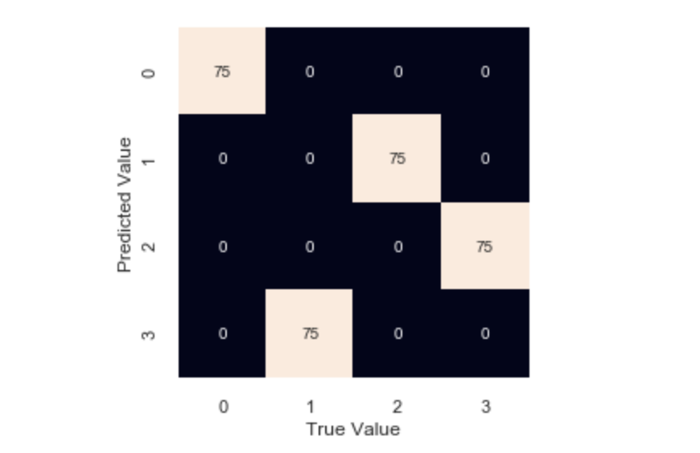

# CSCI-4120

# Team members:
# Seymone Gugneja : gugnejas19@students.ecu.edu
# Brandon Miranda : mirandab19@students.ecu.edu
# Brianna Dirks : dirksb19@students.ecu.edu

# Quick Start
# Make sure Jupyter is installed so that you can run jupyter-notebook from the target directory.

# Which K works the best
# **K=4** works the best for our model

# What is the best K accuracy
# The best K accuracy for our model is **0.25**

# Insert a confusion matrix for the best K
# 
